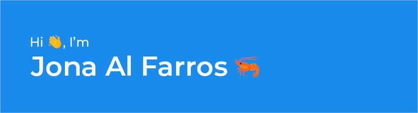

## 
**About**
Student at SMK Taruna Bhakti with a passion for fullstack web development and UI/UX design. I build functional, responsive apps that are not only efficient but also user-friendly, blending code with thoughtful design.
 ‎ 
                     

 

           

