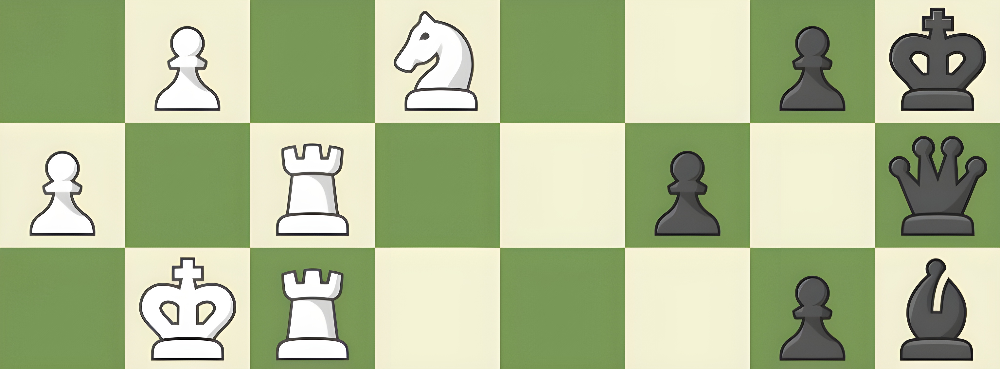

# 💫 About Me:
✨ Hello there! I’m a curious soul exploring the digital cosmos.  
 - 🔭 Currently crafting magic in Web Development & UI/UX Design  
 - 🌱 Continuously learning new things—especially front-end tech & design trends  
 - 🎨 Passionate about creating clean, modern, and user-friendly interfaces  
 - 💬 Let’s talk code, design, or your next creative idea!

Technologies and Tools

                      

## 🌐 Socials:

  
  

# 💻 Tech Stack:
‎   ‎  ‎  ‎    ‎  ‎  ‎  ‎  ‎  ‎ 

# 📊 GitHub Stats:
 
 

## 🏆 GitHub Trophies

### ✍️ Random Dev Quote

### 🔝 Top Contributed Repo

---

